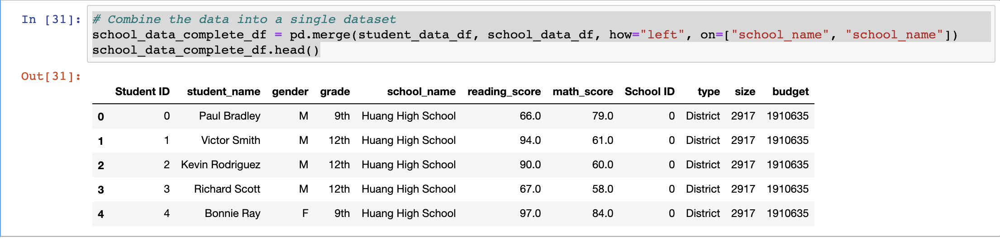
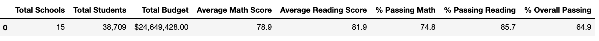
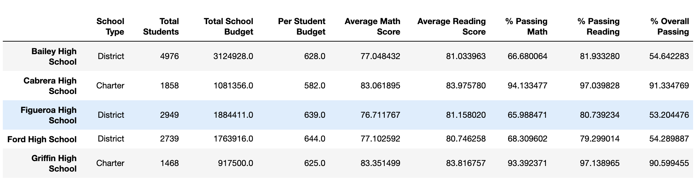

# Note

The Jupyter notebook is not rendered correctly on github. Please use an **nbviewer** based service to view it. Example: https://kokes.github.io/nbviewer.js/viewer.html

You can copy paste the URL of **PyCitySchools_Challenge.ipynb** in the above to view it.

# Overview

In this exercise, we are provided with the data containing math and reading scores of all high schoolders for 15 schools in a county. Additionally, for each school, we are provided with the enrollment numbers and its allocated budget. The analysis exercise requires us to present the passing percentages for both reading and math (as well as overall), and analyze those passing percentages along different dimensions such as:

* Grade level (9th, 10th, 11th and 12th)
* Budget per student
* Enrollment numbers
* Type of school (district versus charter)

Ultimately, the goal of the exercise is to determine if any (or several) of the aforementioned factors influence the passing rate of the students.

# Methodology

We used the Jupyter notebook and Python's pandas module to analyze the data. In a nutshell, the pandas model provides us with:

* Dataframes: A dataframe is a table where each row is indexed. This is the equivalent of an Excel spreadsheet.
* Series: A series is a specific column from the dataframe, where each entry is indexed as well. This is the equivalent of an Excel column.
* A lot of utility functions to manipulate dataframes and series.

Using Python's pandas module and the Jupyter notebook gives us several advantages over using Excel. Some of them are listed below.
* Python is a widespread and a general purpose programming language with a lot of inbuilt support for various data structrutes (such as lists, tuples, dictionaries), string manipulation and offers many add-on packages. Because of the rich ecosystem around Python and its ability to suport external packages and import them seamlessly, it is superior to Excel's programming language - VBA.
* Jypyter offers an integrated environment for coding and visualizing the output in a single pane.
* Jupyter and python are available for free.
* While not proven conclusively, execution of Python code in Jupyter is more performant than the execution of the VBA code in Excel.

## Creating a Complete Dataframe
We are given two datasets in the csv format. The first contains information on schools and the second contains information on students. In total, there are 15 schools and 39,170 students. The first step is to load these datasets in pandas **dataframes**, and **join** them in a single dataframe (similar to Excel's Vlookup or Sql's join). The key to join them on is the **school_name**. The following image displays the code and the output (the top five rows only) of the complete dataframe.



## Creating District Analysis
The district analysis is created using passing score conditions (>=70) across all students for both math and reading. Summary results are calculated and displayed in a single dataframe. The district summary is shown below.


## Per School Summary
The per school summary is calculated by applying the **groupby** function to a series in the dataframe in question (similar to Excel's pivot table or Sql's groupby function). Since the summary is requited to be calculated over each school, the **groupby** function is applied to the **school_name** index. In the code below, the pattern applied to calculate number of students passing math and reading grouped by each school is as follows:
* Filter the original data set to only keep passing students (similar to the Excel filter)
* Apply **groupby** and the aggregating function **count** to get counts per school.

```
# Calculate the passing scores by creating a filtered DataFrame.
per_school_passing_math = school_data_complete_df[(school_data_complete_df["math_score"] >= 70)]
per_school_passing_reading = school_data_complete_df[(school_data_complete_df["reading_score"] >= 70)]

# Calculate the number of students passing math and passing reading by school.
per_school_passing_math = per_school_passing_math.groupby(["school_name"]).count()["student_name"]
per_school_passing_reading = per_school_passing_reading.groupby(["school_name"]).count()["student_name"]
```

A snapshot of per-school summary is shown as below.


## Per School Breakdown
There are four attributes of each school which could influence the passing percentages:
* Grade level
* Budget per student
* Number of students
* School type

For the second and third attributes, since they are **ranges**, we apply a bucketing strategy. Buckets are chosen in a manner to ensure fair distribution of schools. For the **budget per student** attribute, the following buckets are chosen:

| Budget per Student Range ($) | Number of Schools | 
| ---------------------------- |-------------------|
| (0, 585] | 4 |
| (585, 630] | 4 |
| (630, 645] | 4 |
| (645, 675] | 3 |

Similarly, for the **number of students** atttibute, the following buckets are chosen (it is to be noted that the school distribution is not fair in this bucketing strategy):

| Number of students (range) | Number of Schools | 
| -------------------------- |-------------------|
| < 1000, small | 2 |
| (1000, 2000], medium | 5 |
| > 2000, large | 8 |

The implementation for bucket division in Jupyter is as follows:
* Define a bucket using two lists - in the first list, values are chosen (indicating endpoints of each bucket) and the second list contains bucket identifiers.
* Add a new column to the Dataframe using the **pd.cut()** function. The values in this column are assigned from the bucket labels.

Finally, data is now summarized using the **groupby** function along the newly created bucket labels (as opposed to school names). The code below demonstrates for example how average math scores are calculated according to the school size.

```
# Establish the bins.
size_bins = [0, 1000, 2000, 5000]
group_names = ["Small (<1000)", "Medium (1000-2000)", "Large (2000-5000)"]

# Categorize spending based on the bins.
per_school_summary_df["School Size"] = pd.cut(per_school_summary_df["Total Students"], size_bins, labels=group_names)

# Calculate averages for the desired columns. 
size_math_scores = per_school_summary_df.groupby(["School Size"]).mean()["Average Math Score"]
```

# Results

## District Results
The following seven metrics are collected for the total district analysis. We will note for each of these metrics how changes in the input data (removing all math and reading scores of all *9th graders* from the *Thomas High School*) affected it.

| Metric | Prior to Change | After Data Change | Impact |
| ------ |-----------------|-------------------|--------|
| **Total Students** | 39,170 | 38,709 | Reduced by 461, exactly the number of 9th graders of Thomas High School |
| **Total Budget** | $24,649,428 | $24,649,428 | Unaffected |
| **Average Math Score** | 79 | 78.9 | Dipped slightly |
| **Average Reading Score** | 81.9 | 81.9 | Unaffected |
| **Math Passing %** | 75% | 74.8% | Dipped slightly |
| **Reading Passing %** | 85.8% | 85.7% | Dipped slightly |
| **Overall Passing %** | 65.2% | 64.9% | Dipped slightly |

While it may be tempting to conclude that the omission of Thomas High School's 9th graders caused the overall passing percentage numbers to dip, we would have to examine how that omission actually impacted Thomas High School itself. It is possible that Thomas High School is a high performing school, and omission of **any** subset of students would negatively affect the overall district numbers.

## Impact on Thomas High School

We will focus on average scores and passing percentages before and after the data changes 

| Metric | Prior to Change | After Data Change | Impact |
| ------ |-----------------|-------------------|--------|
| **Average Math Score** | 83.4 | 83.4 | Unaffected |
| **Average Reading Score** | 83.8 | 83.9 | Increased slightly |
| **Math Passing %** | 93.3% | 93.2% | Dipped slightly |
| **Reading Passing %** | 97.3% | 97% | Dipped slightly |
| **Overall Passing %** | 90.9% | 90.6% | Dipped slightly |

It can be seen that the average scores are largely unaffected, but there are slight dips in passing percentages.

It would be advantageous to specifically analyze data of Thomas High School's 9th graders, which we didn't do in this exercise.

# Summary

After data fixing, the following changes are made to the district analysis:

* Total students considered in the analysis reduced from 39,170 to 38,709.
* Average math score dropped from 79 to 78.9.
* Math passing percentage reduced from 75% to 74.8%.
* Reading passing percentage reduced from 85.8% to 85.7%.
* Overall passing percentage reduced from 65.2% to 64.9%.
